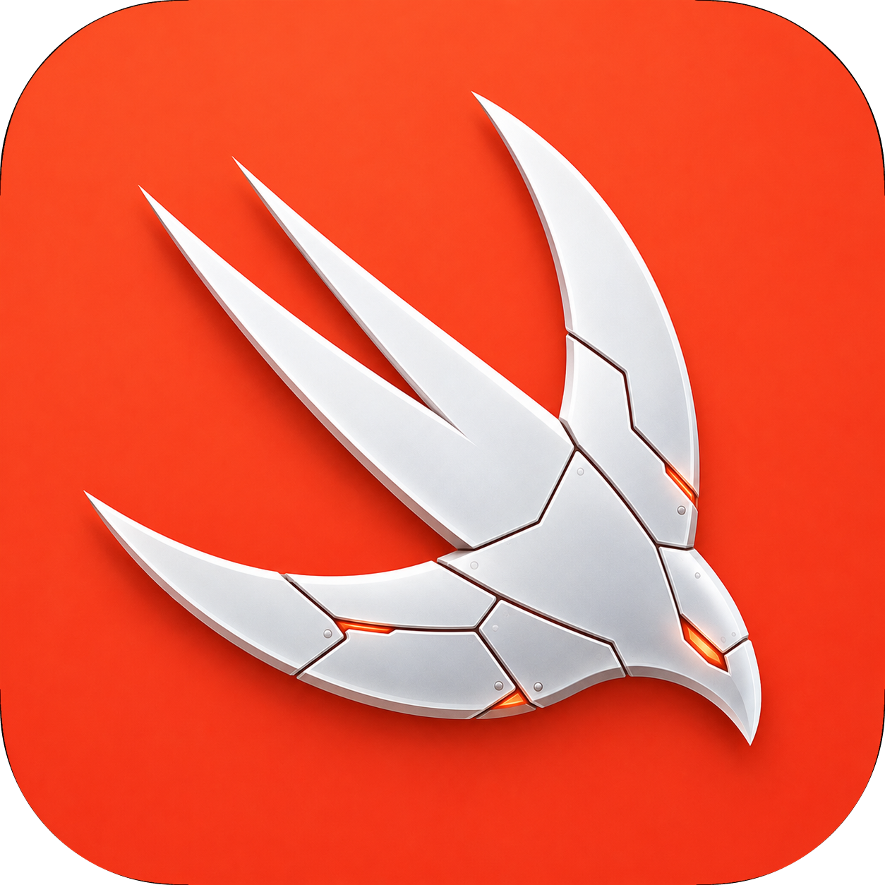

<div align="center">



# SwiftyAI

**The AI toolkit for Swift.** One unified API for text, structured output, tools, agents, and media — across every major provider.

<p>
  <a href="https://swifty-ai.vercel.app"><strong>Documentation</strong></a>
</p>

<p>
  
  
  
  
  
  
</p>

<p>
  
  
  
  
  
  
  
  
  
  
</p>

</div>

---

## Why SwiftyAI

Swap providers by changing one string. Same `generateText`, `streamText`, `generateObject`, and agent loop work everywhere. Native Swift Concurrency, type-safe structured output, tool calling, MCP, middleware, and drop-in SwiftUI hooks — no Python bridge, no glue code.

```swift
let res = try await generateText(model: "openai/gpt-4o", prompt: "Say hi")
print(res.text)
```

Change `"openai/gpt-4o"` → `"anthropic/claude-opus-4"` → `"ollama/llama3"`. Nothing else moves.

---

## Features

| | |
|---|---|
| **10 providers** | OpenAI · Anthropic · Gemini · Groq · OpenRouter · Mistral · Cohere · Cloudflare · Ollama · Apple Foundation |
| **Text generation** | `generateText` — single call, `String` or multimodal prompt |
| **Streaming** | `streamText` → `AsyncThrowingStream`, `onChunk` / `onFinish` hooks |
| **Structured output** | `generateObject` — auto JSON Schema, validated, decoded to your type |
| **Tool calling** | `generateWithTools` / `streamWithTools` — typed tools, multi-step loop |
| **Agents** | Stop conditions, step callbacks, approval gates, parallel tool calls, UI event stream |
| **Media** | `generateImage` · `transcribe` · `generateSpeech` · `generateVideo` |
| **MCP** | `MCPClient` — connect to Model Context Protocol servers, bridge tools straight into the agent loop |
| **Middleware** | Wrap any model: default settings, JSON/reasoning extraction, simulated streaming |
| **SwiftUI hooks** | `@Observable` `AIChat` & `AICompletion` — bind to a view, done |

---

## Install

Swift Package Manager. Add to `Package.swift`:

```swift
dependencies: [
    .package(url: "https://github.com/Kartikayy007/SwiftyAI.git", from: "1.0.0")
]
```

Or in Xcode: **File → Add Package Dependencies** → paste the repo URL.

Requires **iOS 17+ / macOS 14+**, **Swift 5.9+**.

---

## Quick start

Configure keys once at launch:

```swift
import SwiftyAI

AI.configure {
    $0.openAI(apiKey: "sk-...")
    $0.anthropic(apiKey: "sk-ant-...")
    $0.gemini(apiKey: "...")
    $0.ollama() // defaults to http://localhost:11434/v1
}
```

Then call from anywhere. Models are addressed as `"provider/model"`:

```swift
let response = try await generateText(
    model: "anthropic/claude-opus-4",
    prompt: "Explain Swift actors in one sentence."
)
print(response.text)
print(response.usage.totalTokens)
```

---

## Streaming

```swift
for try await chunk in streamText(model: "openai/gpt-4o", prompt: "Write a haiku") {
    print(chunk.text, terminator: "")
}
```

Prefer callbacks? `onChunk` fires per token, `onFinish` hands you the full `AIResponse`:

```swift
let stream = streamText(
    model: "groq/llama-3.3-70b",
    prompt: "Stream me a story",
    onChunk: { print($0.text, terminator: "") },
    onFinish: { print("\n\ntokens:", $0.usage.totalTokens) }
)
for try await _ in stream {}
```

---

## Structured output

Conform your type to `JSONSchemaConvertible` — SwiftyAI builds the schema, validates the model's JSON, and decodes it for you:

```swift
struct Recipe: Decodable, JSONSchemaConvertible {
    let title: String
    let ingredients: [String]
    let minutes: Int
}

let recipe = try await generateObject(
    model: "openai/gpt-4o",
    prompt: "A quick pasta recipe",
    as: Recipe.self
).object

print(recipe.title, recipe.minutes)
```

No fragile string parsing. No stray ```` ```fences ````. Just your type.

---

## Tool calling & agents

Define typed tools, hand them to the model, let it loop:

```swift
let weather = tool(
    name: "getWeather",
    description: "Current weather for a city",
    inputSchema: .object(["city": .string(description: "City name")])
) { (input: WeatherInput) async throws -> String in
    "21°C and sunny in \(input.city)"
}

let result = try await generateWithTools(
    model: "anthropic/claude-opus-4",
    prompt: "What's the weather in Tokyo?",
    tools: [weather],
    maxSteps: 5
)
print(result.text)
```

The loop runs up to `maxSteps`, executes tool calls, feeds results back, and stops on your `stopWhen` conditions. Hook every step with `onStepFinish`, gate execution with `toolOptions` (approval, parallel calls, error policy), or stream agent events to drive a live UI.

---

## SwiftUI hooks

`AIChat` is `@MainActor @Observable` — bind it straight to your view:

```swift
struct ChatView: View {
    @State private var chat = AIChat(model: "openai/gpt-4o")

    var body: some View {
        VStack {
            ForEach(chat.messages) { Text($0.text) }
            TextField("Message", text: $chat.input)
            Button("Send", action: chat.send)
                .disabled(chat.isLoading)
        }
    }
}
```

Streaming, loading state, errors, and stale-stream cancellation handled for you. `AICompletion` does the same for one-shot generations.

---

## Media

```swift
let image = try await generateImage(model: "openai/dall-e-3", prompt: "a red panda coding")
let text  = try await transcribe(model: "openai/whisper-1", audio: audioData)
let audio = try await generateSpeech(model: "openai/tts-1", text: "Hello there")
let video = try await generateVideo(model: "gemini/veo", prompt: "waves at sunset")
```

> Media routing currently resolves through OpenAI and Gemini providers.

---

## MCP

Connect to a [Model Context Protocol](https://modelcontextprotocol.io) server and bridge its tools into the agent loop:

```swift
let client = MCPClient(transport: myTransport)
try await client.initialize()

let mcpTools = try await client.listTools().map { $0.asAITool(client: client) }

let result = try await generateWithTools(
    model: "anthropic/claude-opus-4",
    prompt: "Use the available tools to help me",
    tools: mcpTools
)
```

---

## Middleware

Wrap any model to inject behavior — defaults, JSON extraction, reasoning stripping, or simulated streaming over a non-streaming backend:

```swift
let model = wrapLanguageModel(
    baseModel,
    middleware: DefaultSettingsMiddleware(options: GenerationOptions(temperature: 0.2))
)
```

---

## Providers

| Provider | Configure | Text | Stream | Tools | Media |
|---|---|:--:|:--:|:--:|:--:|
| OpenAI | `openAI(apiKey:)` | Yes | Yes | Yes | Yes |
| Anthropic | `anthropic(apiKey:)` | Yes | Yes | Yes | — |
| Gemini | `gemini(apiKey:)` | Yes | Yes | Yes | Yes |
| Groq | `groq(apiKey:)` | Yes | Yes | Yes | — |
| OpenRouter | `openRouter(apiKey:)` | Yes | Yes | Yes | — |
| Mistral | `mistral(apiKey:)` | Yes | Yes | Yes | — |
| Cohere | `cohere(apiKey:)` | Yes | Yes | Yes | — |
| Cloudflare | `cloudflare(accountID:apiKey:)` | Yes | Yes | Yes | — |
| Ollama | `ollama(baseURL:)` | Yes | Yes | Yes | — |
| Apple Foundation | `appleFoundation()` *(iOS 26+)* | Yes | Yes | Yes | — |


<div align="center">
<sub>Built with Swift • <a href="https://github.com/Kartikayy007/SwiftyAI">github.com/Kartikayy007/SwiftyAI</a></sub>
</div>
